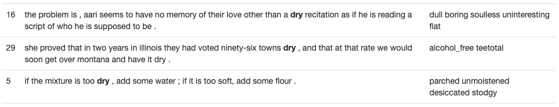

# Lexical Substitution
This project explores the task of finding a suitable substitution for a target word in a sentence. For example, in the following set of sentences the word dry can be replaced with different words provided in the second column. Either dull or teetotal or parched can be suitable replacements for the word dry depending on the context.

The first column is the index of the target word (also shown in bold-face in the examples above) which we need to substitute with another word/phrase that is a suitable replacement in the context of this sentence. In some cases the substitute provided by human annotators for this dataset might be a phrase, e.g. alcohol_free is a substitute for dry in the second example above.    

This task is closely related to the task of identifying the different word senses of the target word.

The dataset we used was collected by asking humans to provide words (and sometimes phrases) as substitutes for particular target words. They were provided with the full sentence so that they can choose the substitute word based on the context.

The data we used is taken from the following shared task data:

SemEval-2007 Task 10: English Lexical Substitution Task. Diana McCarthy, Roberto Navigli.

The data and the evaluation have been modified to make it a simpler task. Your task will be to provide 10 guesses as to the appropriate substitute word and if any of the 10 guesses match the substitute word preferred by the human annotator it will be considered correct. We will be using a simplified form of the various evaluation scores provided in the above paper. Your program will be allowed 10 guesses and we check if any of them match the set of words provided by the human annotators.

This project explored the use of word vectors aka word embeddings for this task. We will be using a pre-trained collection of word vectors that has been trained on a large corpus of text data.

## Implementation

The first file we wrote is called retrofit.py. This file updates the GLOVE word embeddings by looking at the wordnet ontology graph. This graph maps semantic relations between words, which we used to update the word vectors. By initially setting the Alpha and Beta to 1, we were able to achieve a baseline score of ~40.5.    

The next step we took was to perform hyperparameter tuning on Alpha and Beta. We attempted various weighting techniques here (exponential decay, linear, sin, etc), but these were attempted out of curiosity rather than logical reason. In the end, we found that simply keeping these values constant worked best. The optimal value for alpha was 0.11 and the optimal value of Beta was 0.975. This tuning of the hyperparameters resulted in a dev score of ~48.2 which was our best score.
  

Another interesting strategy we tried was to use context words in addition to retrofitting. In our implementation, we simply added context vectors to the retrofitting embeddings and then renormalized the vectors. In theory, this should have increased the score we achieved on the dev set, but we could not achieve high accuracy with this method. Whether this was due to an incorrect normalization function, or an incorrect inference implementation we are not sure. The best score we were able to achieve here was ~0.28.
As we were unable to include the context words in our predictions, the most similarly predicted words were constant based on the input. The result of this is shown below on the first three lines of dev.txt. The substituted word is "side".   

### No Retrofitting    
sides edge bottom front club line both back place corner  
sides edge bottom front club line both back place corner  
sides edge bottom front club line both back place corner    

### Retrofitting (No hyperparameter tuning)    

edge position place line while front back along way on  
edge position place line while front back along way on  
edge position place line while front back along way on    

### Retrofitting (With hyperparameter tuning)  

position point slope edge way heading line english place while  
position point slope edge way heading line english place while  
position point slope edge way heading line english place while    

### Context Based Similarity    
already came were took they had having was been has  
already came were took they had having was been has  
already came were took they had having was been has    

The retrofitted embeddings were computed using retrofit.py, and the context based similarity was implemented in default.py. We stored out best word embeddings in the glove.6B.100d.retrofit.magnitude file.

## Installation

Make sure you setup your virtual environment:

    python3 -m venv venv
    source venv/bin/activate
    pip install -r requirements.txt

You can optionally copy and modify the requirements for when we
test your code:

    cp requirements.txt answer/requirements.txt

## Required files

You must create the following files:

    answer/lexsub.py
    answer/lexsub.ipynb

## Create output.zip

To create the `output.zip` file for upload to Coursys do:

    python3 zipout.py

For more options:

    python3 zipout.py -h

## Create source.zip

To create the `source.zip` file for upload to Coursys do:

    python3 zipsrc.py

For more options:

    python3 zipsrc.py -h

## Check your accuracy

To check your accuracy on the dev set:

    python3 check.py

For more options:

    python3 check.py -h

In particular use the log file to check your output evaluation:

    python3 check.py -l log

The accuracy on `data/input/test.txt` will not be shown.  We will
evaluate your output on the test input after the submission deadline.

## Default solution

The default solution is provided in `default.py`. To use the default
as your solution:

    cp default.py answer/lexsub.py
    cp default.ipynb answer/lexsub.ipynb
    python3 zipout.py
    python3 check.py

Make sure that the command line options are kept as they are in
`default.py`. You can add to them but you must not delete any
command line options that exist in `default.py`.

Submitting the default solution without modification will get you
zero marks.

## Data files

The data files provided are:

* `data/sample_vec.txt` -- small sample word vector file
* `data/lexicons` -- different lexicons / ontologies used for retrofitting
* `data/input` -- input files `dev.txt` and `test.txt`
* `data/reference/dev.out` -- reference output for the `dev.txt` input file
